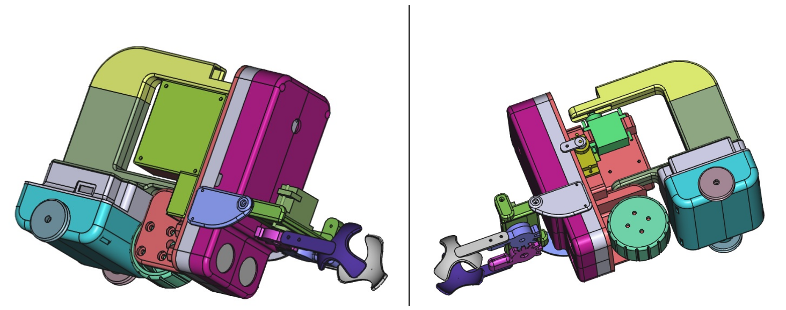

# BallBot

An arduino robot to collect PingPong balls. It contains: 
1. ESP32 Cam module to provide optical info and WiFi controllabillity
2. 3 servo motors (9g servo) for ball claws, head (ESP32 cam) and drive wheel direction rotation
3. Brushless DC motor as the main drive wheel (Gimbal Brushless Motor for Gopro 808) 
4. Brushless motor driver
5. Li-Ion battery 3.7V (2 x 18650 in parallel)
6. 2 nickel strips on the bottom of the battery pack as charging rails
7. Li-Ion charger module with battery protection and 5V boost module to power the ESP32 Cam module
8. DC/DC boost module to raise the battery voltage to 6V for the BLDC motor driver and to power the servo motors

The casing is 3D printed using cheapest PLA.
The screws are 1mm x 10mm. If you are building your own please edit the 3D model to support what ever screws you are using.
The screw holles are made smaller and screws are heated using a soldering iron before they were screwd in, to melt the plastic and create threads.

## Server

1. ESP32 CAM configured as a WiFi access point or station. You can choose on initialization of WiFi
2. ESP32 runs an HTTP server to provide video stream, manual control and API access

## Building the firmware

Generally you can use the Arduino IDE and in Preferences add the ESP32 board manager.
```
https://raw.githubusercontent.com/espressif/arduino-esp32/gh-pages/package_esp32_index.json
```
After that you can select the ESP32 Cam board and build the firmware. I also provided scripts that can build and upload the firmware via USB. You can find them at:

        tools/build_firmware.sh
        tools/upload_firmware.sh

I prefer using the VS Code or Antigravity to Arduino IDE, so all you need is to install the C/C++ extension and then ask the AI to set up the build environment for you, so it can find the correct libraries and provide the code complete and prediction.

## Updating ESP32 firmware via WiFi
There is an /api/ota endpoint to which you need to make a post request to trigger the update. Basically you need to serve the image file and then trigger the update by sending the url where the image can be downloaded. I provided a python script to simplify this at:

        tools/update_firmware.py

The only requirement is `pip install requests`

The partition scheme you will need is one with OTA. Just in case you need it, you can find it at:

        tools/partitions.csv

You only need to upload the image once via USB to adjust the partition scheme. After that you can use the WiFi update mechanism which only sends the application image to the ESP32, so the partition scheme needs to be correctly pre-defined and will not be changed by the WiFi upload process.


## WARNING
The WiFi AP causes a lot of electrical noise, so the camera tends to freeze due to processing errors. To prevent it, make sure you have a module with an antenna, which you place on the side, behind the camera and glue the camera to the SD card slot to allow it to shield it.

