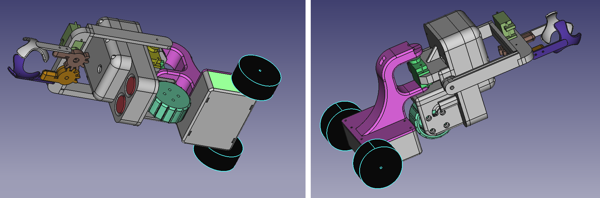

# BallBot

An arduino robot to collect PingPong balls. It contains: 
1. ESP32 Cam module to provide optical info and WiFi controllabillity
2. 3 servo motors (9g servo) for ball claws, head (ESP32 cam) and drive wheel direction rotation
3. Brushless DC motor as the main drive wheel (Gimbal Brushless Motor for Gopro 808) 
4. Brushless motor driver
5. Li-Ion battery 3.7V (2 x 18650 in parallel)
6. 2 nickel strips on the bottom of the battery pack as charging rails
7. Li-Ion charger module with battery protection and 5V boost module to power the ESP32 Cam module
8. DC/DC boost module to raise the battery voltage to 6V for the BLDC motor driver and to power the servo motors

The casing is 3D printed using cheapest PLA.
The screws are 1mm x 10mm. If you are building your own please edit the 3D model to support what ever screws you are using.
The screw holles are made smaller and screws are heated using a soldering iron before they were screwd in, to melt the plastic and create threads.

## Status

Just starting the project, so it is not yet usable.

